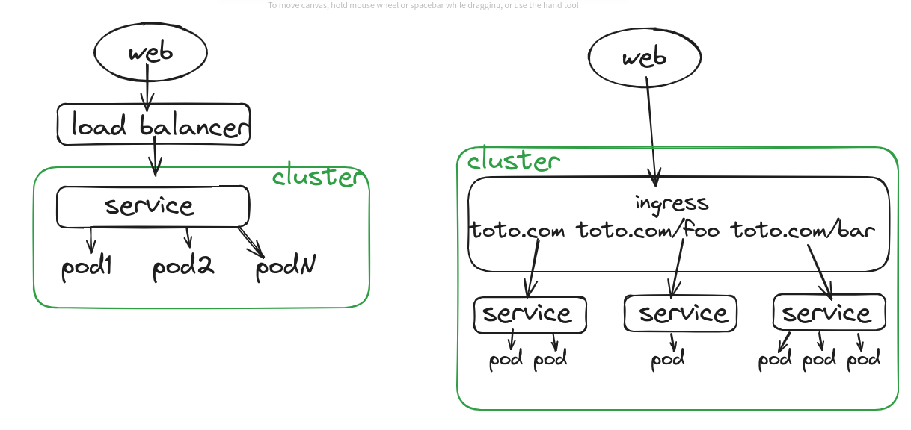

# Kubernetes cheat sheet

* [Kubectl](#kubectl)
    + [Context](#context)
        - [List all contexts](#list-all-contexts)
        - [Show the current context](#show-the-current-context)
        - [Set the current context to my-cluster-name ](#set-the-current-context-to-my-cluster-name)
        - [Rename a context](#rename-a-context)
    + [Namespace](#namespace)
        - [List all namespaces in cluster](#list-all-namespaces-in-cluster)
        - [Create a namespace in current context](#create-a-namespace-in-current-context)
        - [Change namespace](#change-namespace)
        - [List events in a namespace](#list-events-in-a-namespace)
        - [List all services in the namespace](#list-all-services-in-the-namespace)
        - [List all pods in all namespaces](#list-all-pods-in-all-namespaces)
        - [List all pods in the current namespace, with more details](#list-all-pods-in-the-current-namespace-with-more-details)
    + [Deployment](#deployment)
        - [Describe a deployment](#describe-a-deployment-name-namespace-labels-annotations-selector-replicas-strategy-pod-template-events)
        - [Show information about a deployment](#show-information-about-a-deployment-name-ready-state-up-to-date-state-available-state-age)
    + [Pod and node](#pod-and-node)
        - [List all pods in the current namespace](#list-all-pods-in-the-current-namespace)
        - [Get a pod's YAML definition](#get-a-pods-yaml-definition)
        - [Describe commands with verbose output](#describe-commands-with-verbose-output)
        - [Connect to the terminal of a running pod](#connect-to-the-terminal-of-a-running-pod)
        - [See pod logs](#see-pod-logs)
        - [Save pods logs to a file](#save-pods-logs-to-a-file)
* [helm](#helm)
    + [List all deployments](#list-all-deployments)
    + [Dry run (simulate installation process) with detailed debug output](#dry-run-simulate-installation-process-with-detailed-debug-output)
* [Relationship: Container (Docker) - Orchestrator (K8s) - Package manager (helm)](#relationship-container-docker---orchestrator-k8s---package-manager-helm)
* [Value injection from a CI/CD pipeline to the application](#value-injection-from-a-cicd-pipeline-to-the-application)
* [More on how Kubernetes works](#more-on-how-kubernetes-works)
     + [Entry points](#entry-points)
     + [Replicaset vs Daemonset](#replicaset-vs-daemonset)
     + [Service](#service)
     + [Pod](#pod)
     + [State](#state)
     + [Loose coupling](#loose-coupling)
     + [Reference to configMap values in manifests](#reference-to-configmap-values-in-manifests)

## Kubectl

### Context

📝 context = group of access parameters (cluster, user, namespace...)

#### List all contexts

`kubectl config get-contexts`

#### Show the current context

`kubectl config current-context`

#### Set the current context to my-cluster-name

`kubectl config use-context my-cluster-name`

#### Rename a context

`kubectl config rename-context old-name new-name`

### Namespace

#### List all namespaces in cluster

`kubectl get ns`

#### Create a namespace in current context

`kubectl create namespace my_namespace`

#### Change namespace

`kubectl config set-context --current --namespace my-namespace`

#### List events in a namespace

`kubectl get event –namespace my-namespace`

#### List all services in the namespace

`kubectl get services`

#### List all pods in all namespaces

`kubectl get pods --all-namespaces`

#### List all pods in the current namespace, with more details

`kubectl get pods -o wide`

### Deployment

#### Describe a deployment (name, namespace, labels, annotations, selector, replicas, strategy, pod template, events)

`kubectl describe deployment`

#### Show information about a deployment (name, ready state, up-to-date state, available state, age)
 
`kubectl get deployment my-deployment`

### Pod and node

#### List all pods in the current namespace

`kubectl get pods`

#### Get a pod's YAML definition

`kubectl get pod my-pod -o yaml`       

#### Describe commands with verbose output

`kubectl describe nodes my-node`

`kubectl describe pods my-pod`

#### Connect to the terminal of a running pod

`kubectl exec --stdin --tty pod_name -- /bin/bash`

#### See pod logs

`kubectl logs pod_name`

#### Save pods logs to a file

`kubectl logs pod_name > app.log`

| 📝 Open output logs and don't show lines with "abc" `grep -v "abc" app.log` |
|-----------------------------------------------------------------------------|
| 📝 Open output logs and only show lines with "abc" `grep "abc" app.log`     |
| 📝 Make it case insensitive with the parameter `-i`                         |

## helm

### List all deployments

`helm list`

### Dry run (simulate installation process) with detailed debug output

`helm install release_name ./chart_path --dry-run --debug`

## Relationship: Container (Docker) - Orchestrator (K8s) - Package manager (helm)

K8s Cluster (= Kubernetes environment)

---K8s namespace (= logical container for resources)

-------helm release (= instance of a helm chart running in a K8s namespace)

-----------K8s deployment (= set of identical pods)

----------------k8s pod (= smallest deployable unit in Kubernetes)
 
-------------------Docker container 

K8s node (= server that runs the Kubernetes runtime and hosts the pods)

## Value injection from a CI/CD pipeline to the application

| CI/CD pipeline | helm               | Kubernetes                                                                                                        | Container (Linux env)                      | Application (source code)                                   |
|----------------|--------------------|-------------------------------------------------------------------------------------------------------------------|--------------------------------------------|-------------------------------------------------------------|
| variable       | values.yml *       | configmap/secrets/config file (reference configurations and provide them to the container)                        | Environment variable (or volume for files) | app properties                                              |
| FOO_BAR = 1    | foo: bar: $FOO_BAR | data: FOO_BAR = {{.Values.foo.bar}} (name used in the values.yaml file to do the mapping, could be whatever name) | FOO_BAR = (value received from Kubernetes) | foo.bar = ${{foo_bar}} (syntax depends on project language) |

(*) Don't use dash `-` in values.yaml keys!

## More on how Kubernetes works

### Entry points

* Service: Provides a single IP for the cluster. The cluster IP is only visible inside the cluster.
* Load balancer: Exposes an external IP to outside the cluster and routes the traffic to the service. Lives outside the cluster (usually provided by a Cloud provider).
* Ingress controller (service mesh): Load balancer that can handle several services (=> several IP addresses available for the cluster.). Lives inside the cluster.



### Replicaset vs Daemonset

Replicaset: 2 => 2 pods, distribution is not transparent
Daemonset: 2 => 2 pods, but each pod is distributed on a different node (1 pod per node)

### Service

Abstraction to group pods under a common access policy. They have a virtual IP which clients within the cluster can access and proxied to the pods in the service.

### Pod

Collection of containers that share the same resources.

All containers in a pod have the same host.

Inside the pod, each container has a localhost address (127.0.0.1) and a static port (user defined in the pod definition) => easy to move from a local/uncontainerized environment to a containerized environment. 
These ports are not visible outside the pod.

The pod has an IP address, fix and unique in the cluster.

A pod is created with the resource type (kind) "deployment". The kind "pod" is hardly ever used, it creates a standalone pod that is not managed by the controller.

### State

Kubernetes components are stateless. They read and update their state in a database provided by the Kubernetes API.
That database is a key-value store named "etcd". When a component restarts, it retrieves its state from etcd.

### Loose coupling

```
kind: Service                       kind: Deployment 
   spec:                                 metadata: 
        selector:                            labels: 
            app: APPNAME                        app: APPNAME 
            component:  
```

Any pod with label app: APPNAME will be targeted by the service with that selector

### Reference to configMap values in manifests

Create a container with an environment variable with a specific key of a configMap

```
spec: 
   containers: 
       - name: <name> 
            valueFrom:  
               configMapKeyRef: 
                  name: <configmap_name> 
                  key: <key> 
```

Create a container with environment variables with all keys of a configMap

```
spec: 
   containers: 
       - name: <name> 
            envFrom:  
               configMapRef: 
                  name: <configmap_name> 
```
